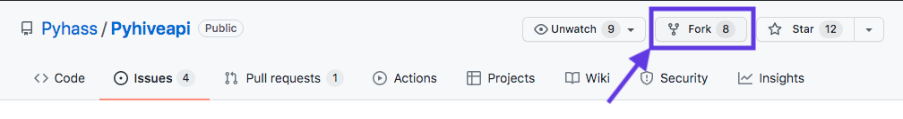
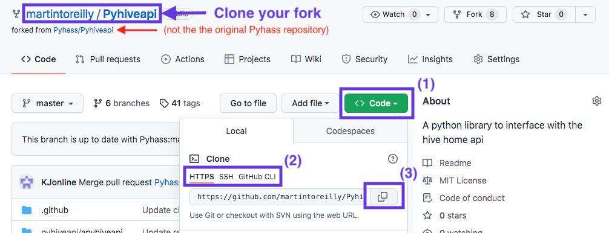

# Contributor guide

## Code of conduct
All contributors are expeced to abide by our [code of conduct](./CODE_OF_CONDUCT.md).

## Getting the source code
We use GitHub to manage development for the project. To get a copy of the source code that will allow you to easily make and test changes yourself while also making it easy to contribute those changes back to the project please do the following.

- Fork the project to your own GitHub account by clicking the "Fork" button at the top left of the page when viewing the original [Pyhass/Pyhiveapi](https://github.com/Pyhass/Pyhiveapi) repository on GitHub.
  
- Clone **your forked repository** using your preferred Git tooling. You can get the URIs to use for cloning via HTTPS, SSH or GitHub CLI tool by (1) clicking the green "Code" button on the left at the top of the file list, (2) clicking the relevant option under "Clone" and (3) clicking the "Copy" icon.
   

## Setting up a development environment

### Set up a virtual environment for development
#### ⚠️ Naming your virtual environment ⚠️
We strongly recommend you use `.venv` as the name for your virtual environment. Using this name with either the `venv` or `virtualenv` methods described below will create a `.venv` folder within the project directory and install your development virutal environemnt there.
This directory is listed in the project `.gitignore` file and so will not be checked into GitHub when you make changes.

If you want to use another directory for your virtual environment, please choose a directory **outside** the project root directory to minimise the risk of checking in your virtual environment to GitHub when making changes.

#### For python versions 3.4 and higher
Python versions 3.4 and higher come with built-in support for the `venv` module for virtual environment creation and this has been the recommended way to create virtual environments from python version 3.5.

To set up a virtual environment using your default version of python, run `python -m venv .venv` from within the root of the project directory.

To set up a virtual environment using a different version of python than your default version, run `<path-to-python-version> -m venv .venv` from within the root of the project directory - e.g. `python3 -m venv .venv` or `/usr/local/bin/python3.9 -m venv .venv`. This different python version must still be version 3.4 or higher.

_Note: Support for `venv` was added in python v3.3, but `pip` was only installed by default in v3.4_

#### For earlier versions of python
For earlier versions of python, you can use the [`virtualenv`](https://virtualenv.pypa.io/) module to set up a virtual environment for development.

To create a virtual environment for a particulatr version of python, run `virtualenv .venv -p <path-to-python-version>`.

_Note: If you prefer `virtualenv` to `venv`, you can continue using it for python versions 3.3 and higher if you choose._

### Install the package with development dependencies
This package auto-generates the synchronous versions of many of its functions using the the [`unasync`](https://pypi.org/project/unasync/) package.
This additional "build" step means you cannot just install the package using `pip` with the `-e` "editable" option and see the imapct of your changes as you make them.

Instead you must re-install the package **every time you want to test a change** by running `pip install .[dev]` from the root directory of the project (using `.[dev]` rather than just `.` will install the additional dependencies required to run the project tests).

## Generating test data

### Generating realistic fake test data
Some of the fields require data of a certain format.
While it may not be necessary for this data to be in the required format for test purposes, we recommend using fake but correctly formatted test data where possible.
We don't want to use real data as our test data is public on the internet and we don't want to make email addresses, phone numbers or postal addresses of real people public.

We've used the following approaches to create realistic but non-identifying fake data.

#### ID fields
ID fields in the Hive beekeeper API responses are "version 4" random UUIDs. We generate fake "version 4" UUIDs using an [online generator](https://createuuid.com/v4/), but keep ensure that we reflect valid relationships between entries by ensuring consistent values of fields that reference other devices by ID (e.g. `parent`, `consumer` fields etc).

#### Person names
We use the following format for generating names for users, with `<user_number>` replaced with the user number (e.g. `1 User Street` for user 1, `999 User Street` for user 999).

```json
"firstName": "Test",
"lastName": "User<user_number>",
```

#### Email addresses
IANA maintain a list of [reserved domain names](https://www.iana.org/domains/reserved), including `example.com`.
You can safely use `<any-string>@example.com` as an email address and be confident it will never be a real email address.
We use email addresses of the format `test.user<user_number>@example.com`.

#### Phone numbers
Ofcom maintain a list of [reserved UK telephone number ranges](https://www.ofcom.org.uk/phones-telecoms-and-internet/information-for-industry/numbering/numbers-for-drama) for use in TV and radio drama programmes that "will not be allocated to communications providers in the foreseeable future".
There 1,000 reserved numbers for each of a range of UK regions and key non-geographic number types (e.g. mobile, freephone, UK-wide, premium rate).

We use the London range in international format for the `phone` field (`+442079460XXX`), replacing `XXX` with the zero-padded number of the test user (e.g. `+442079460001` for user 1 and ``+442079460999` for user 999).

We use the mobile range in international format for the `mobile` field (`+447700900XXX`), again replacing `XXX` with the zero-padded number of the test user.

#### Addresses
We are not aware of UK address data reserved for test or example purposes.
For the purposes of test data for this project, we will create addresses with a fake street address line of the format `<user_number> User Street` but using the data for for [Buckingham Palace, London](https://checkmypostcode.uk/sw1a1aa) for the remaining fields (Buckingham Palance is the London residence of the queen of the United Kingdom).

### Example fake data
Altogether this results in fake data of the following format, with `<user_number>` replaced with the user number wherever it appears.

#### User data
```json
"user": {
  "id": "e6b07a3d-0afe-488c-a345-d9d03006fac1",
  "username": "test.user<user_id>@example.com",
  "firstName": "Test",
  "lastName": "User<user_number>",
  "address": "<user_number> User Street",
  "city": "London",
  "country": "United Kingdom",
  "countryCode": "GB",
  "postcode": "SW1A 1AA",
  "longitude": -0.1416,
  "latitude": 51.501,
  "email": "test.user<user_id>@example.com",
  "mobile": "++442079460001",
  "phone": "+447700900001",
  "timezone": "Europe/London",
  "locale": "en-GB",
  "temperatureUnit": "C"
}
```

#### Home data

```json
"homes": [
  {
      "id": "6b0a21c2-2eb2-43af-a546-d119b679441a",
      "name": "Home",
      "address": "<user_number> User Street",
      "location": {
          "country": "GB",
          "state": null,
          "timeZone": "Europe/London",
          "latitude": 51.501,
          "longitude": -0.1416,
          "addressFirstLine": "<user_number> User Street",
          "addressSecondLine": null,
          "city": "London",
          "postcode": "SW1A 1AA"
      },
      "primary": true,
      "userType": "OWNER",
      "homeUsers": {
          "SUPERUSER": [
              "edbab90bb-e78e-44ad-835d-b61bcad84dff"
          ],
          "OWNER": [
              "e6b07a3d-0afe-488c-a345-d9d03006fac1"
          ]
      },
      "users": [
          "edbab90bb-e78e-44ad-835d-b61bcad84dff"
      ],
      "owners": [
          "e6b07a3d-0afe-488c-a345-d9d03006fac1"
      ],
      "homeTypes": [
          "HIVE"
      ],
      "invitations": [
          {
              "invitationId": "072a0b52-04c8-4e8d-8edc-9350106a4bec",
              "recipient": "Test Guest 1",
              "accepted": true,
              "expired": false,
              "revoked": false,
              "homeId": "6b0a21c2-2eb2-43af-a546-d119b679441a",
              "userType": "SECONDARY_USER",
              "invitedBy": "user:e6b07a3d-0afe-488c-a345-d9d03006fac1"
          }
      ],
      "homePicture": null,
      "shareOption": "FLEXIBLE",
      "pets": null,
      "notificationChannels": [
          "PUSH"
      ],
      "pinId": null,
      "userNicknames": {
          "edbab90bb-e78e-44ad-835d-b61bcad84dff": "Test Guest 1"
      },
      "proResponseProviders": [],
      "homePhase": "Live",
      "owner": true
  }
]
```

## Experimenting with the Hive beekeeper API
The Hive beekeeper API is not publicly documented and this library has been created by reverse engineering the API endpoints by querying them using tools such as [Postman](https://www.postman.com/downloads/).

### Authenticating to the Hive beekeeper API
If you'd like to query the Hive beekeeper endpoints directly, you can get an authorization token by running the `tests/get_hive_authorization_token.py` script and logging in with your Hive Home credentials (you will be prompted for a 2FA code if one is required). The script will print an authorization token to the terminal.

Once you have the authorization token you must ensure this is passed to every call to the beeekeeper API as the value of the `Authorization` header field.
Each authorization token lasts one hour.

To avoid having to kep re-entering your password when doing lots of exploring of the Hive beekeeper API, you can create a `secrets` directory in the project root directory and create a `hive_credentials.py` file in this folder with the following contents. The `secrets` folder is included in the project's `.gitignore` file, so will not be checked into version control.

```python
hive_credentials = {
    "username": "replace-with-your-hive-username",
    "password": "replace-with-your-hive-password"
}
```

### Known Hive beekeeper API endpoints
Known Hive beekeper API endpoints are listed below. The `Content-Type` header field must be set to `application/json` for `POST` calls.

### Nodes endpoint
- URL: `https://beekeeper.hivehome.com/1.0/nodes/all`
- HTTP method: `GET`
- Parameters:
    - `devices`: whether to include devices in the reponse data (`true` or `false`, deaults to `true`)
    - `products`: whether to include products in the reponse data (`true` or `false`, deaults to `true`)
    - `actions`:  whether to include actions in the reponse data (`true` or `false`, deaults to `true`)
    - `homeId`: if the user has access to another home, this field can be used to pass the ID of that home. If not provided, data is returned for the user's default / primary home. If an invalid `homeId` is provided then no device, product or action data is returned.
- Returns: A JSON response with the following fields.
    - `user`: A dictionary containing information about the current authenticated user, including user ID, name, address, email, phone, mobile and locale.
    - `status`: Not sure. Perhaps overall system status? Often (always?) `OK`
    - `alerts`: Not sure. Perhaps whether various warning / failure alerts should or have been sent? Contains `failuresEmail`, `failuresSMS`, `warningsEmail`, `warningsSMS` and `nightAlerts` fields, all usually (always?) set to `false`. 
    - `media`: Not sure. Contains a single `allowAnalyticsSharing` field , set to `false`.
    - `products`: List of Hive and "Works with Hive" products. Shares a lot of entries with the contents of the `devices` field.
    - `devices`: ist of Hive and "Works with Hive" devices. Shares a lot of entries with the contents of the `products` field. Not totally clear why this is, but it seems that the `devices` field might represent the physical devices and the `products` field might represent the controllable interfaces to these devices. Some notable differences below.
        - `devices` contains the top-level parent `hub` (the internet connected Hive Hub).
        - `devices` contains the `boilermodule` (the controller wired to the boiler) as a direct child of the `hub`. 
        - `devices` contains the `thermostatui` (the battery powered wireless standalone heating / hot water controller), as a direct child of the `hub` (though with the `boilermodule` also referencing it directly via its `tui` field).
        - `products` contains `heating` and `hotwater` as direct children of the `boilermodule` device. These have the same `model` as the `boildermodule` and, each have a `state` field with `mode`, `schedule` and `boost` fields. The `state` fields for the `boilermodule` and `thermostatui` `device` entries only contain the device name (which is the same for the `boilermodule` and `thermostatui` devices and the `heating` and `hotwater` products and is updated for all of them when the name of the Thermostat/Heating device in the Hive app or web app).
        - `products` contains groups of devices that have been created in the Hive Home app or web app.
        - Philips Hue lights have entries in both `devices` and `products`, but the `devices` entries are marked read-only and the `products` entries contain all the meaningful `state` fields like `status`, `brightness`, `colourTemperature`, `mode` and `schedule`. The `state` fields for the corresponding `device` entries only contain the device name.

### Devices endpoint
- URL: `https://beekeeper.hivehome.com/1.0/devices/`
- HTTP method: `GET`
- Parameters:
    - `homeId`: if the user has access to another home, this field can be used to pass the ID of that home. If not provided, data is returned for the user's default / primary home. If an invalid `homeId` is provided then no device, product or action data is returned.
- Returns: A JSON response containing the contents of the `devices` field in the response from the `nodes` endpoint.

### Poducts endpoint
- URL: `https://beekeeper.hivehome.com/1.0/products/`
- HTTP method: `GET`
- Parameters:
    - `homeId`: if the user has access to another home, this field can be used to pass the ID of that home. If not provided, data is returned for the user's default / primary home. If an invalid `homeId` is provided then no products are returned.
- Returns: A JSON response containing the contents of the `products` field in the response from the `nodes` endpoint.

### Actions endpoint
- URL: `https://beekeeper.hivehome.com/1.0/products/`
- HTTP method: `GET`
- Parameters: None. `homeId` is not supported for the `actions` endpoint. All actions for the user's default / primary home are returned, regardless of the value of `homeId` passed, which is the behaviour for any unsupported parameter.
- Returns: A JSON response containing the contents of the `actions` field in the response from the `nodes` endpoint (but always for the user's default / primary home).

### Temperature history endpoint
- URL: `https://beekeeper.hivehome.com/1.0/history/heating/f5c22d15-3ed9-477d-83b6-7f2e238c1298?start=1638399600000&end=1640991600000&timeUnit=MINUTES&rate=1
- HTTP method: `GET`
- Parameters:
    - `start`: Timestamp as [milliseconds since unix epoch](https://www.epochconverter.com/). Data seems to be go back to `00:00:00 GMT` on `01 Jan 2019`. 
    - `end`: Timestamp as milliseconds since unix epoch. It appears that a year is the longest reliably retrievable time period. People have experienced `404 - Not found` errors when querying longer time periods.
    - `timeUnit`: `YEARS`, `DAYS`, `HOURS`, `MINUTES` or `SECONDS`. 
    - `rate`: Integer value
    - `operation`: Only valid value appears to be `AVG`, which is the default if this parameter is omitted.
- Returns: A JSON response with the following fields.
    - `data`: A single field containing an average temperature entry for either each requested `timeUnit` or, where the raw records are not frequent enough to support an average for the requested `timeUnit`, raw temperature records. The shortest time seen between two raw records is 2 minutes and the longest is 30 minutes (though this could potentially be much longer during periods where either your Hive system, the Hive beekeeper API or your internet provider were experiencing problems). Each entry contains the following fields.
        `date`: Timestamp of average or raw record as milliseconds since unix epoch.
        `temperature`: Temperature at `date` (average or actual, depending on the `timeUnit` requested and the frequency of the underlying raw temperature records). No units are provided. Temperatures are presumably in the unit specified in the `temperatureUnit` field of the `user` element in the `node` endpoint response.

### Heating state endpoint
- URL: `https://beekeeper-uk.hivehome.com/1.0/nodes/heating/<id-of-heating-product-entry>`
- HTTP method: `POST` (remember to set the `Content-Type` header field to `application/json`)
- Request body: A JSON string matching the structure of the `state` field in the `heating` entry in the list of products returned by the `nodes` or `products` endpoints. The editable fields of the `state` element and their permitted values are.
    - `name`: (type: `String`) Sets the value of the `state->name` field in the `heating` and `hotwater` product entries, the  `state->name` and `state->zoneName` fields in the `boilermodule` device entry and the `state->zoneName` field of the `thermostatui` device entry (its `state->name` field remians the default value of `Thermostat`). After renaming the these products via setting the `heating->state->name` field, both the `Receiver` and `Thermostat` devices are labelled with the new name in the "Manage devices" screen of the app and web app (while still labelled as `Receiver` and `Thermostat` underneath the new name).
    - `mode:` (type: `String`) One of `OFF`, `MANUAL`, `SCHEDULE`, `BOOST`. It can take a bit of time for the transition to `BOOST` mode to be reflected in the response to a query to the `product` endpoint.
    - `target`: (type: `Float`) The target temperature as set by the `MANUAL`, `SCHEDULE` or `BOOST` settings. No units are provided. Temperatures are presumably in the unit specified in the `temperatureUnit` field of the `user` element in the `node` endpoint response. 
        - When the mode is `SCHEDULE` this sets the target temperature for the current schedule slot only, in the same manner to changing the temperature in the app or web app while in schedule mode.
        - When the mode is `BOOST` this sets the target temperature for the boost duration only.
        - When the mode is `OFF`, this will be automatically set to the value of the `frostProtection` field.
        - While the `target` can be set to a lower temperature in `MANUAL` mode, in this case it would be expected that the frost protection feature would still kick in at the higher `frostProtection` temperature.
    - `frostProtection`: (type: `Float`) The minimum value the temperature will be allowed to fall to before the boiler's forst protection feature turns the boiler on to maintain this minimum temperature.
    - `boost`: (type: `Integer`) Integer minutes of boost duration. May transiently be set if the mode is not `BOOST` but will clear after a short while.
    - `autoBoost`: (type: `String`) One of `DISABLED` or `ENABLED`. Not sure what the auto boost function does. The `heating` product entry has an `autoBoost` field as part of its `props` field with the following elements, but setting the `state -> autoBoost` field to `ENABLED` doesn't set the `props -> autoBoost -> active` field to `true`
        `active`: So far only `false` has been observed, but can presumably be `true`. This doesn't seem to mirror the value of `state -> autoBoost` as setting this to `ENABLED` does not set `props -> autoBoost -> active` to `true`. Perhaps this field only becomes `true` when an auto boost has been triggered.
        `target`: Appears to be a temparature. Can be set by setting `state -> autoBoostTarget`.
        `duration`: Appears to be the duration of the auto boost in minutes. Not clear if or how this can be altered from the default of 30 minutes.
        `trvs`: Presumably an array of IDs for individual radiator TRVs associated with the `heating` product `zone`.
    - `autoBoostTarget`: (type: `Float`) Sets the value of the `heating` product's `props -> autoBoost -> target` field but does not actually trigger a boost, even when `state -> autoBoost` is `ENABLED`.
    - `optimumStart`: (type: `Boolean`) Can be `true` or `false`. Not sure what this does.
    - `schedule`: A weekly schedule dictionary, with one entry for each day of the week with the lowercase full day name as their keys and a list of timeslot dictionaries as their values (i.e. `schedule`: { "monday": [...], "tuesday": [...], "wednesday": [...], "thursday": [...], "friday": [...], "saturday": [...], "sunday": [...] }. Each timeslot is a dictionary with the following fields.
        - `start`: (type: `Integer`) Start time of timeslot as minutes after midnight (00:00) on the day.
        - `value`: A dictionary with the following single field
                - `target`: (type: `Float`) Target temperature for timeslot. No units are provided. Temperatures are presumably in the unit specified in the `temperatureUnit` field of the `user` element in the `node` endpoint response.
- Returns: A JSON response containing a copy of the JSON submitted to the endpoint. Invalid `state` fields are ignored.
- Errors: This endpoint returns the following HTTP errors in addition to the usual `403 - Forbidden` returned from all endpoints when the authorization token is not valid.
    - `400 - Bad request`: Returned when the endpoint cannot parse the submitted JSON effectively. This reponse can come with two different JSON bodies. It's not totally clear what the difference is between the two but we note the situations in which we have observed these two cases below.
        - `{ "error": "MALFORMED_REQUEST" }`: This has been observed when missing a comma between two dictionary entries.
        - `{ "message": "Could not process payload" }`: This has been observed when missing a closing double quote on a string, or escaping a closing double quote with a backslash (e.g. `"String contents\"`)
